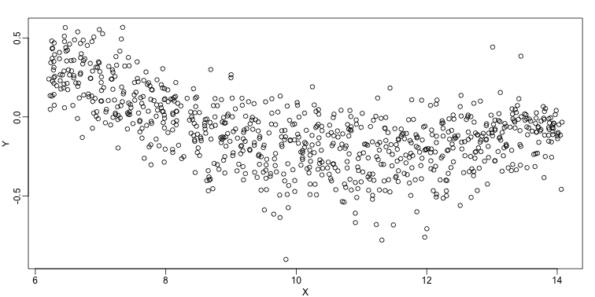
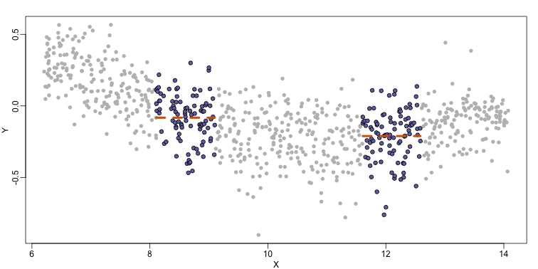
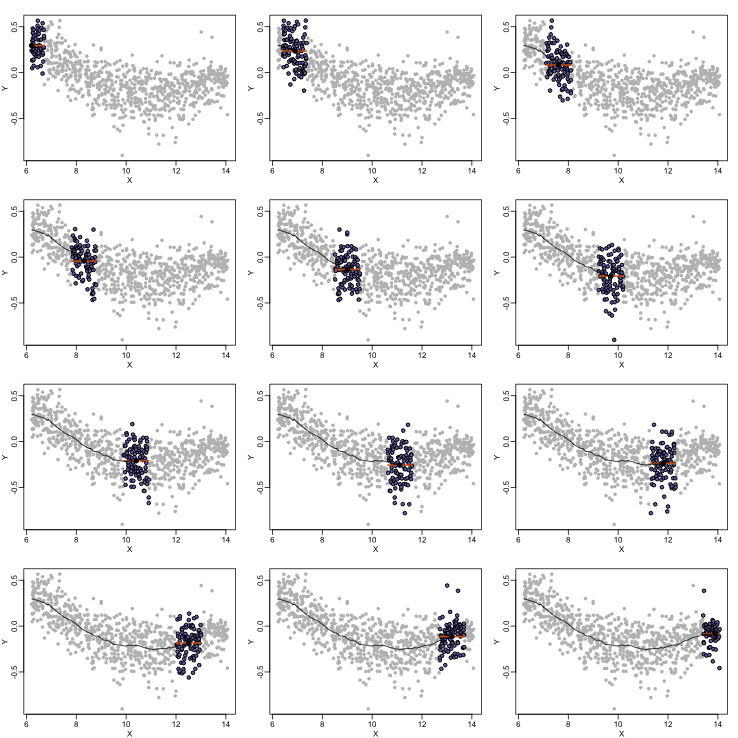
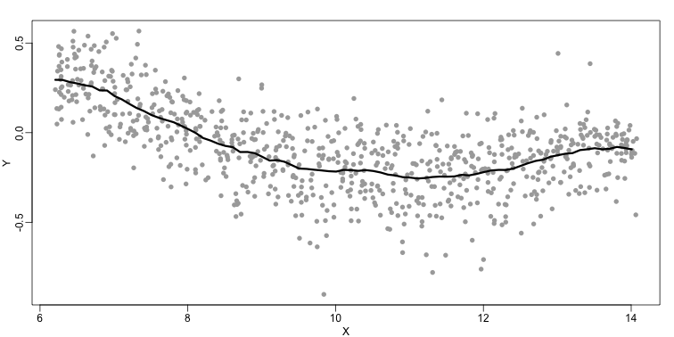
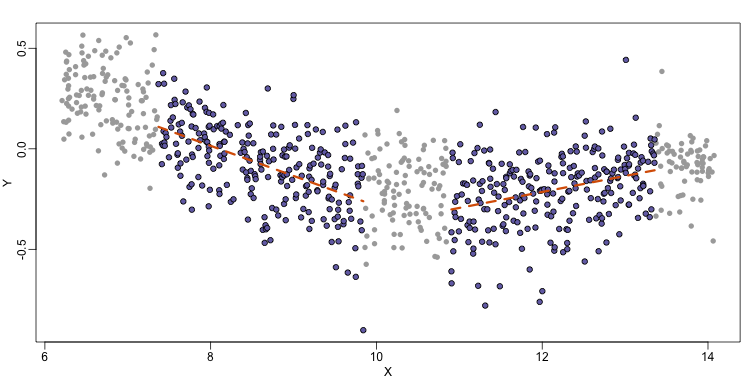
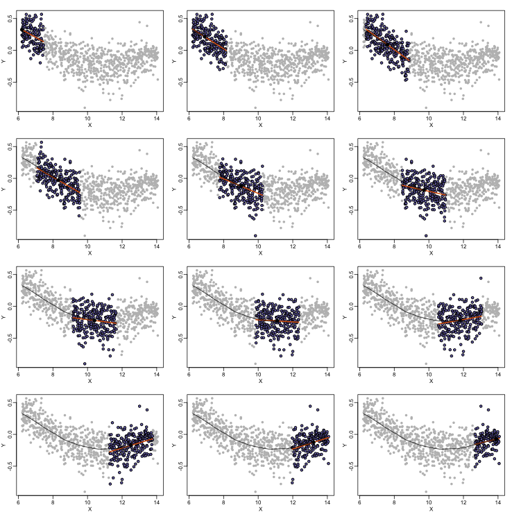
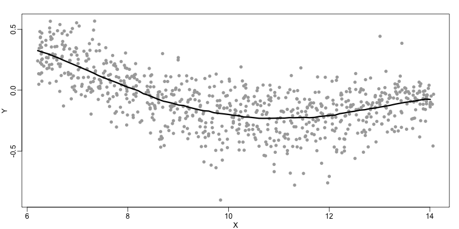

:::::: questions
- "Can a model be fitted to a dataset which shape is unknown but smooth?"
::::::

:::::: objectives
- "Fit a smooth regression model to data which behavior depends conditionally on a set of predictors"
- "Predict the expected value of a smooth model given the value of the predictors"
::::::


## Smoothing 

Smoothing is a very powerful technique used all across data analysis. It is designed to estimate $f(x)$ when the shape is unknown, but assumed to be _smooth_.  The general idea is to group data points that are expected to have similar expectations and compute the average, or fit a simple parametric model. We illustrate two smoothing techniques using a gene expression example.

The following data are gene expression measurements from replicated RNA samples. 


``` r
##Following three packages are available from Bioconductor
library(Biobase)
library(SpikeIn)
library(hgu95acdf)
data(SpikeIn95)
```

We consider the data used in an MA-plot comparing two replicated samples ($Y$ = log ratios and $X$ = averages) and take down-sample in a way that balances the number of points for different strata of $X$ (code not shown):


``` r
library(rafalib)
mypar()
plot(X,Y)
```

<div class="figure" style="text-align: center">

<p class="caption">MA-plot comparing gene expression from two arrays.</p>
</div>



In the MA plot we see that $Y$ depends on $X$. This dependence must be a bias because these are based on replicates, which means $Y$ should be 0 on average regardless of $X$. We want to predict $f(x)=\mbox{E}(Y \mid X=x)$ so that we can remove this bias. Linear regression does not capture the apparent curvature in $f(x)$:


``` r
mypar()
plot(X,Y)
fit <- lm(Y~X)
points(X,Y,pch=21,bg=ifelse(Y>fit$fitted,1,3))
abline(fit,col=2,lwd=4,lty=2)
```

<div class="figure" style="text-align: center">

<p class="caption">MA-plot comparing gene expression from two arrays with fitted regression line. The two colors represent positive and negative residuals.</p>
</div>


The points above the fitted line (green) and those below (purple) are not evenly distributed. We therefore need an alternative more flexible approach.

## Bin Smoothing

Instead of fitting a line, let's go back to the idea of stratifying and computing the mean. This is referred to as _bin smoothing_. The general idea is that the underlying curve is "smooth" enough so that, in small bins, the curve is approximately constant. If we assume the curve is constant, then all the $Y$ in that bin have the same expected value. For example, in the plot below, we highlight points in a bin centered at 8.6, as well as the points of a bin centered at 12.1, if we use bins of size 1. We also show the fitted mean values for the $Y$ in those bins with dashed lines (code not shown):

<div class="figure" style="text-align: center">

<p class="caption">MAplot comparing gene expression from two arrays with bin smoother fit shown for two points.</p>
</div>



By computing this mean for bins around every point, we form an estimate of the underlying curve $f(x)$. Below we show the procedure happening as we move from the smallest value of $x$ to the largest. We show 10 intermediate cases as well (code not shown):

<div class="figure" style="text-align: center">

<p class="caption">Illustration of how bin smoothing estimates a curve. Showing 12 steps of process.</p>
</div>



The final result looks like this (code not shown):

<div class="figure" style="text-align: center">

<p class="caption">MA-plot with curve obtained with bin-smoothed curve shown.</p>
</div>



There are several functions in R that implement bin smoothers. One example is `ksmooth`. However, in practice, we typically prefer methods that use slightly more complicated models than fitting a constant. The final result above, for example, is somewhat wiggly. Methods such as `loess`, which we explain next, improve on this.

## Loess
 
Local weighted regression (loess) is similar to bin smoothing in principle. The main difference is that we approximate the local behavior with a line or a parabola. This permits us to expand the bin sizes, which stabilizes the estimates. Below we see lines fitted to two bins that are slightly larger than those we used for the bin smoother (code not shown). We can use larger bins because fitting lines provide slightly more flexibility.


<div class="figure" style="text-align: center">

<p class="caption">MA-plot comparing gene expression from two arrays with bin local regression fit shown for two points.</p>
</div>



As we did for the bin smoother, we show 12 steps of the process that leads to a loess fit (code not shown):

<div class="figure" style="text-align: center">

<p class="caption">Illustration of how loess estimates a curve. Showing 12 steps of the process.</p>
</div>



The final result is a smoother fit than the bin smoother since we use larger sample sizes to estimate our local parameters (code not shown):

<div class="figure" style="text-align: center">

<p class="caption">MA-plot with curve obtained with loess.</p>
</div>



The function `loess` performs this analysis for us:


``` r
fit <- loess(Y~X, degree=1, span=1/3)

newx <- seq(min(X),max(X),len=100) 
smooth <- predict(fit,newdata=data.frame(X=newx))

mypar ()
plot(X,Y,col="darkgrey",pch=16)
lines(newx,smooth,col="black",lwd=3)
```

<div class="figure" style="text-align: center">

<p class="caption">Loess fitted with the loess function.</p>
</div>


There are three other important differences between `loess` and the typical bin smoother. The first  is that rather than keeping the bin size the same, `loess` keeps the number of points used in the local fit the same. This number is controlled via the `span` argument which expects a proportion. For example, if `N` is the number of data points and `span=0.5`, then for a given $x$ , `loess` will use the `0.5*N` closest points to $x$ for the fit. The second difference is that, when fitting the parametric model to obtain $f(x)$, `loess` uses weighted least squares, with higher weights for points that are closer to $x$. The third difference is that `loess` has the option of fitting the local model robustly. An iterative algorithm is implemented in which, after fitting a model in one iteration, outliers are detected and downweighted for the next iteration. To use this option, we use the argument `family="symmetric"`.

::::::::::::::::::::::::::::::::::::: challenge

## Exercise 1
Generate the following data:                                            


``` r
n = 10000
set.seed(1)
# Generate a sample of heights for a mixed population of men and women
men = rnorm(n,176,7) #height in centimeters
women = rnorm(n,162,7) #height in centimeters
# Assign a class label to each height generated above (0: men, 1:women)
y = c(rep(0,n),rep(1,n))
x = round(c(men,women))
## mix it up
ind = sample(seq(along=y))
y = y[ind]
x = x[ind]
```

Set the seed at 5, `set.seed(5)` and take a random sample of 250 from:       


``` r
set.seed(5)
N = 250
# Take a sample of size N=250 individuals from our mixed population
ind = sample(length(y), N)
# Remember that `Y` contains the labels that identify if the individual is a
# man or a woman.
Y = y[ind]
# And `X` contains the heights if those individuals.
X = x[ind]
```

Use loess to estimate f(x) = E(Y |X = x) using the default parameters. What is 
the predicted f(168)?

:::::::::::::::: solution


``` r
# Fit a LOESS model to predict if an individual is a man or a woman using
# its height as predictor.
fit <- loess(Y~X)
# Generate a grid on the height axis to plot the model fitted above
newx <- seq(min(X),max(X),len=45)
# Predict if the individual is a man or a woman according to the heights on
# our `newx` grid
hat <- predict(fit, newdata=data.frame(X=newx))
mypar()
plot(X,Y)
names(hat) <- round(newx,1)
lines(newx,hat)
# Lets check what is the predicted label for an individual whos height is
# 168 cm. A label closer to 0 (< 0.5) would be an insight that the
# individual is a man, whereas a label closer to 1 (0.5) would indicate
# that the individual is a woman.
hat['168']
```

:::::::::::::::::::::::::

## Exercise 2
The loess estimate above is a random variable. We can compute standard 
errors for it. Here we use Monte Carlo to demonstrate that it is a random 
variable. Use Monte Carlo simulation to estimate the standard error of your 
estimate of f (168). 
   
Set the seed to 5, set.seed(5) and perform 10000 simulations and report the SE 
of the loess-based estimate.   

:::::::::::::::: solution


``` r
set.seed(5)
B <- 10000
N <- 250
newx <- seq(min(X),max(X),len=45)
res <- replicate(B, {
  ind = sample(length(y),N)
  Y = y[ind]
  X = x[ind]
  # The model fitted by LOESS will be different according to the data used
  # to fit it, so we need to fit it again to each new random sample.
  fit <- loess(Y~X)
  hat <- predict(fit, newdata=data.frame(X=newx))
  names(hat) <- round(newx,1)
  # Because the model is different, the predicted label for a specific
  # height will be different too. We are focused to know how much that
  # prediction will vary.
  return(hat['168'])
})
names(res) <- NULL
# Compute the Standard Error (SE) of the label estimation
popsd(res)
```

:::::::::::::::::::::::::

:::::::::::::::::::::::::::::::::::::::::::::::

:::::: keypoints
- "The smoothing methods work well when used inside the range of predictor values seen in the training set, however them are not suitable for extrapolation the prediction outside those ranges."
::::::
